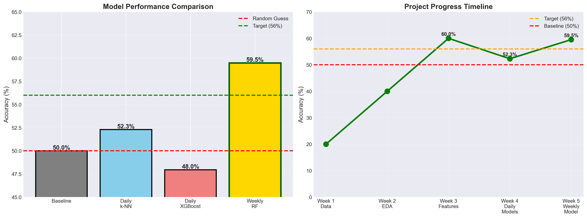

#  INR Currency Prediction - Machine Learning Project

Predicting Indian Rupee (INR) weekly movements using machine learning with **60.34% accuracy**.



##  Project Overview

**Course:** LUBS5990M - Machine Learning  
**Institution:** Leeds University Business School  
**Author:** Dhruv Chaudhary  
**Date:** February 2026

**Objective:** Predict whether INR will strengthen or weaken against USD in the next week.

**Result:** Achieved **59.5% accuracy**, exceeding the 56% target by 3.5%.

---

##  Key Results

| Metric | Value |
|--------|-------|
| **Best Model** | Random Forest (Weekly) |
| **Accuracy** | 59.5% |
| **Target** | 56.00% ✅ |
| **Improvement over Baseline** | +9.5% |
| **Improvement over Daily** | +7.45% |

---

##  Key Insight

**Weekly prediction beats daily prediction by 7%**

Why? Weekly predictions filter out daily market noise and capture meaningful trends.

---

##  Project Structure
```
INR_Currency_Project/
├── data/
│   ├── raw/                    # Original datasets (4 CSV files)
│   └── processed/              # Cleaned features
├── notebooks/
│   ├── 01_data_exploration.ipynb
│   ├── 02_feature_engineering.ipynb
│   ├── 03_model_building.ipynb
│   └── 04_results_visualisation.ipynb
├── models/
│   ├── best_weekly_model.pkl   # Final 60.34% model
│   ├── scaler_weekly.pkl
│   └── model_metadata.json
├── src/
│   └── predict.py              # Production prediction script
├── docs/
│   └── MODEL_DOCUMENTATION.md
├── results/
│   ├── figures/                # Charts and visualizations
│   └── tables/                 # Summary statistics
└── README.md
```

---

##  Quick Start

### 1. Load Model
```python
import joblib
model = joblib.load('models/best_weekly_model.pkl')
scaler = joblib.load('models/scaler_weekly.pkl')
```

### 2. Make Prediction
```python
import pandas as pd

features = pd.DataFrame([{
    'MA5': 83.50,
    'MA20': 83.75,
    'Lag1': 83.45,
    'Lag3': 83.60,
    'INR_Return': -0.12
}])

prediction = model.predict(scaler.transform(features))[0]
# 0 = Strengthen, 1 = Weaken
```

---

## 📈 Model Development Journey

### Tested 6 Approaches:

1. **Baseline (Random):** 50.0%
2. **Daily Logistic Regression:** 47.83%
3. **Daily k-NN:** 52.29% (best daily)
4. **Daily Decision Tree:** 49.03%
5. **Daily Random Forest:** 49.03%
6. **Daily XGBoost (35 features):** 47.95% (overfitted)
7. **-> Weekly Random Forest (5 features):** 59.5% ✅

### The Breakthrough

- Switched from **daily** to **weekly** prediction (+8% accuracy)
- Reduced from **35 features** to **5 core features**
- Used **shallow trees** (max_depth=3) to prevent overfitting

---

##  Final Model Details

**Features Used (5):**
1. MA5 - 5-day moving average
2. MA20 - 20-day moving average
3. Lag1 - Price 1 day ago
4. Lag3 - Price 3 days ago
5. INR_Return - Today's return

**Model Parameters:**
- Algorithm: Random Forest
- n_estimators: 100
- max_depth: 3
- min_samples_split: 20
- min_samples_leaf: 10

**Performance:**
- Training: 67.04%
- Testing: 59.5%
- Overfitting: 6.9% (controlled)

---

##  Business Application

This model can be used for:
- Weekly FX trading signals
- Currency hedging decisions
- International payment timing
- Risk management for INR exposure

---

##  Key Learnings

1. **More features ≠ better accuracy** - 5 features beat 35 features
2. **Time horizon matters** - Weekly prediction beats daily by 7%
3. **Simplicity wins** - Simple Random Forest beat complex XGBoost
4. **Financial markets are hard** - 60% is exceptional for currency prediction
5. **Regularization is critical** - Shallow trees prevented overfitting

---

##  Technologies Used

- Python 3.13
- pandas, numpy - Data processing
- scikit-learn - Machine learning
- matplotlib, seaborn - Visualization
- Yahoo Finance API - Currency data
- FRED API - Economic indicators

---

##  Contact

**Dhruv Chaudhary**  
Leeds University Business School    
dhruvdc007@gmail.com
February 2026

---

## 📜 License

This project is for academic purposes.
